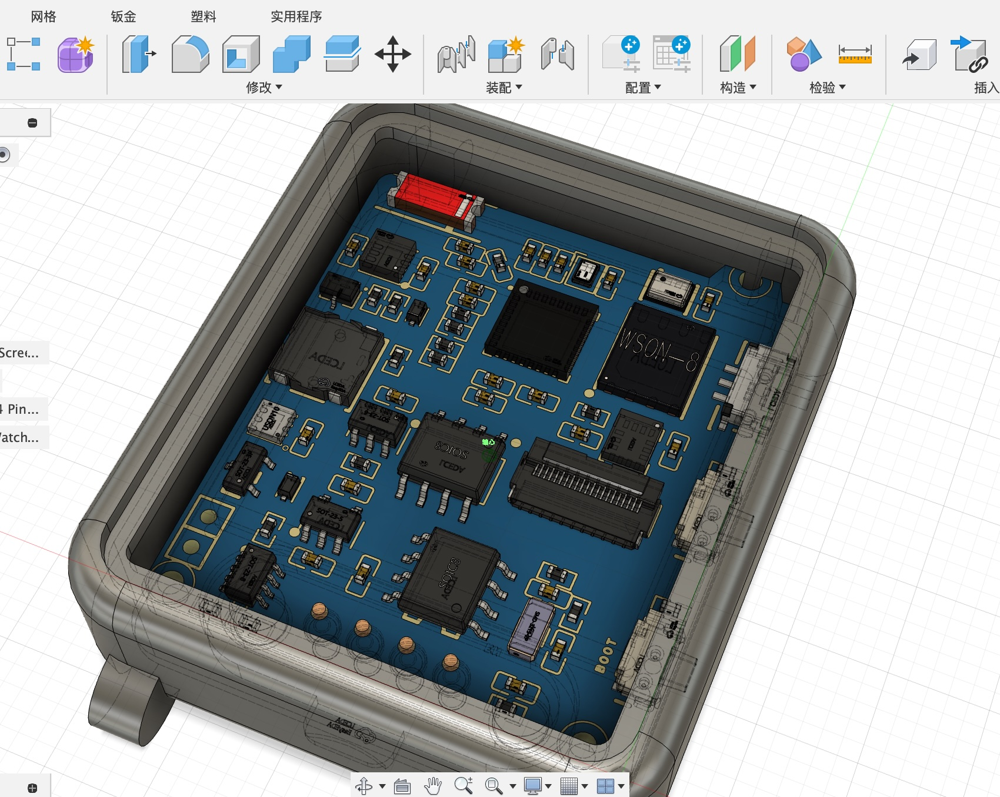

# ThymeWatchColor
ESP32-C3 Smart Watch with JDI 8-Color Memory Display

## 使用到的 IC 和器件

主控: ESP32-C3 with *16MB* external QIO Flash （上外置flash 16MB，比ESP32-C3FH4内置4MB的宽裕点）

| IC | Function | 备注 |
| -- | -- | -- |
| HE9073A33M5R | 超低静态电流 LDO | 100mV drop-out, 0.3µA IQ, 500mA max |
| W25Q128JVPIQ | 3.3V 128 Mbit(18MB) Flash |  ESP32C3 支持最大 16MB |
| LPM013M126C | 176x176 JDI 8色记忆屏，带背光，带触摸 | 总成贴合 |
| IT7259 | 屏幕电容触摸 IC | I2C 地址见下方 |
| TP4057 | 充电 | CHRG 和 STDBY 悬空 |
| INA219 | V/A meter | 直接通过I2C测量到锂电池充放电状态、电流和电压信息，方便界面显示电池状态 |
| CA-C03 | 小红2.4G天线 | N/A |

## IO Pins 和一些关键连接

* 使用经典的 PMOS+二极管的VBUS/VBAT选择电路，输出 VSYS 送给 LDO
* 没有单独 RESET 按钮（容易误触），而是用侧面的物理拨动开关控制整个系统的 VSYS 通电
* IO0-IO5 是 RTC 电源域，可做deepsleep唤醒、可做ADC
* IO9 是 BOOT，作为一个 DOWN 按钮，一共两个按钮
* 刷机可以断电再按住 BOOT 再通电，起到 RESET+BOOT 的效果
* LCD_DISP 上拉到 3V3，默认一直打开显示，省 GPIO

| Pin | Function | 备注 |
| -- | -- | -- |
| IO0 | TP_INT | 触摸IC中断 |
| IO1 | IMU_INT | 加速度传感器中断 |
| IO2 | RTC_INT | 时钟中断 |
| IO3 | BUZZER | 蜂鸣器，用 NMOS 下管控制低功耗，默认断开 |
| IO4 | BUTTON_UP | 上按钮。按下是低电平，已外部上拉 |
| IO5 | LCD_BACKLIGHT | 背光，可直接用ESP32-C3的LEDC/PWM 控制，MCU驱动电流足够 |
| IO6 | LCD_SCLK | 屏幕 SPI: 时钟 |
| IO7 | LCD_SI | 屏幕 SPI: MOSI |
| IO8 | LCD_CS | 屏幕 SPI: CS |
| IO9 | BUTTON_DOWN (Boot) | 下按钮。启动模式选择，按下是低电平，内部弱上拉，额外有外部上拉 |
| IO10 | TP_RESET | 触摸屏 RESET |
| IO18 | USB D- | 和磁吸 USB DM 相连 |
| IO19 | USB D+ | 和磁吸 USB DP 相连 |
| IO20 | I2C_SCL | 原来是 U0RXD，现在是 SCL，外部上拉 |
| IO21 | I2C_SDA | 原来是 U0TXD，现在是 SDA，外部上拉 |
| 5V | 5V | 和磁吸 VBUS 5V 相连 |
| GND | GND | 和磁吸 GND 相连 |

## I2C Addresses

| Address | Device |备注 |
| -- | -- | -- |
| 0x40 | INA219 | 高精度V/A传感器（锂电池端充放电电压/电流）700µA工作电流，由VDD_SPI供电，主控休眠自动断电 |
| 0x44 | OPT3001 | 环境光强传感器（0.01 lux至83k lux大范围+红外阻隔）低功耗1.8µA 秒杀光敏电阻 |
| 0x45 | SHT30 | 温湿度 |
| 0x46 | IT7259  | 触摸 IC |
| 0x51 | PCF8563 | RTC 二选一 |
| 0x68 | DS3231MZ+ | RTC 二选一 |
| 0x69 | BMI270 | 六轴加速度/陀螺/抬腕识别 |
| 0x76 | BMP280 | 温湿度压强传感器 |

## 理论功耗

| Product | Processor | Cores |Frequency | Modem-sleep | Light-sleep | Deep-sleep |
| --|--|--| - | -| -| - |
| ESP8266 | Tensilica Xtensa® 32-bit L106 RISC| 1| 80 MHz (default) or 160 MHz | 15 mA | 0.9 mA| 20 µA |
| ESP32 | Tensilica Xtensa® single/dual-core 32-bit LX6 | 2 | Up to 240 MHz (160 MHz for ESP32-S0WD)| 20 ~ 68 mA | 0.8 mA | RTC timer + RTC memory: 10 µA RTC timer only: 5 µA|
| ESP32-S2 | Xtensa® single-core 32-bit LX7 microprocessor | 1 | Up to 240 MHz | 10 ~ 23 mA | 750 µA | ULP sensor-monitored pattern: 22 µA RTC timer + RTC memory: 25 µA RTC timer only: 20 µA |
| ESP32-S3 | Xtensa® dual-core 32-bit LX7 microprocessor | 2 | Up to 240 MHz | 13.2 ~ 91.7 mA | 240 µA | RTC memory and RTC peripherals: 8 µA RTC memory, RTC peripherals are powered down: 7 µA |
| ESP32-C3 | 32-­bit RISC-­V single-­core processor | 1 | Up to 160 MHz | 13 ~ 23 mA | 130 µA | RTC timer + RTC memory: 5 µA |

## 实际功耗

V2: 排查过程:

带SPI 30.1mA
不刷屏只有delay() 只有 18.14mA

带屏幕 1.40 mA
不带屏幕 1.38 mA（可能触摸IC？）

INA219 写入 power save mode后，0.43到0.38mA 左右

VDD_SPI 1.393V

休眠SDA竟然不是3.3V，是1.4V？？

咔嚓掉DS3231MZ+的VCC后：300.1mA，SDA 上升到 2.401V了
咔嚓了DS3231MZ+的SDA，SCL后，SDA电压还是2.4V
咔嚓掉 OPT3001后，休眠 263uA 了，但是电压还是2.4V，后来又282uA
咔嚓掉BMP280，没带屏幕的情况下，14-19微安！（SDA从不休眠3.283V->到休眠3.243V）

带触摸屏：24.5 微安，比 v1 的 15.1µA 略高

老 V1: Deepsleep: 15.1 µA (通过测试，上下按钮的上拉电阻几乎不额外耗电，因为高阻态)
Wake up: ~ 20 mA

* Serial.begin() 消耗 115 µs

## 关于 RTC Interrupt

* TODO: 接了 RTC Interrupt 后，IO0 内部弱上拉电阻不起作用，IO0电平一直是0，所以后续考虑使用 ESP32 的 RTC 作为闹钟唤醒。PS 是否需要外部上拉？

## 关于启动速度

* 在 setup() 或者app_main() 函数里使用 millis() 函数来探测第一行代码的消耗时间，消耗时间主要在 esp32 的 bootloader，并且默认app代码分区越大，bootloader验证分区数据完整性所需要的时间越长。
* 但是！deepsleep后重新唤醒默认是不需要再经过验证的，这块代码可以去看idf的bootloader实现。
* 测试数据：2MB大程序需要的验证时间大约是200ms+，去掉验证只需要40ms左右。
* 如果想要第一次也跳过验证，需要加入这一行宏：
CONFIG_BOOTLOADER_SKIP_VALIDATE_ALWAYS=y

## 续航计算

https://www.digikey.cn/zh/resources/conversion-calculators/conversion-calculator-battery-life
