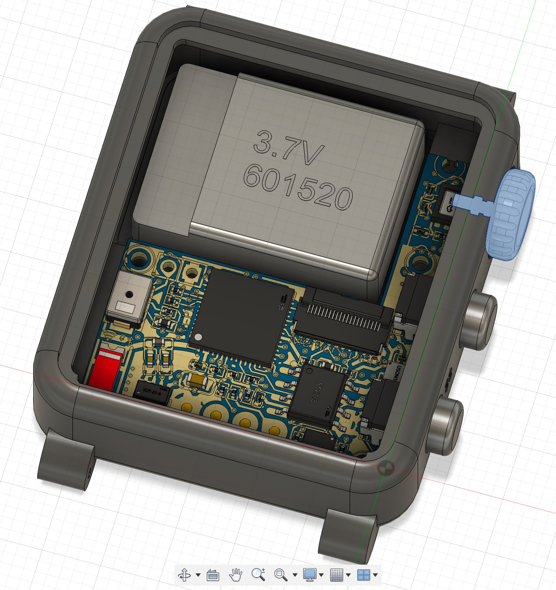
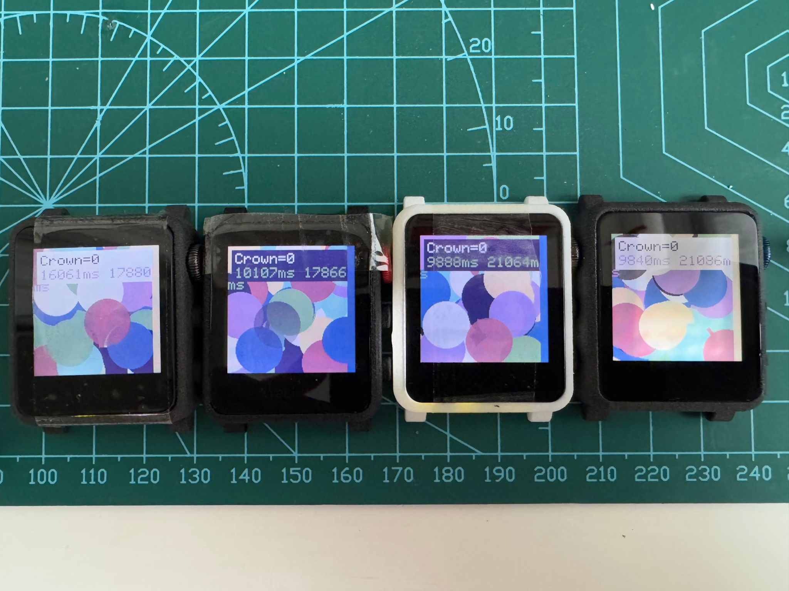
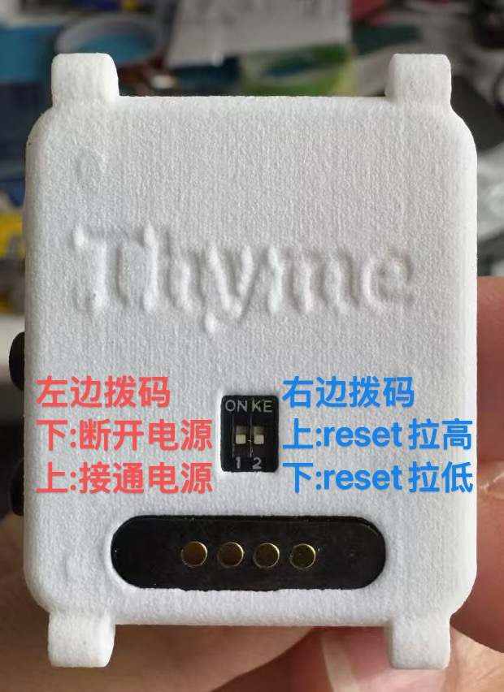

# ThymeWatchColor-S3
ESP32-S3 Smart Watch with JDI 8-Color Memory Display

>  From Linus:  
> **This is a really cool and awesome watch project!**

## 背面2位拨码开关

## 使用到的 IC 和器件

主控: ESP32-S3-PICO-1-N8R2

| IC | Function | 备注 |
| -- | -- | -- |
| HE9073A33M5R | 超低静态电流 LDO | 100mV drop-out, 0.3µA IQ, 500mA max |
| ESP32-S3-PICO-1-N8R2 | SIP 带晶振带外围去偶电容全封装芯片 |  ESP32-S3 |
| LPM013M126C | 176x176 JDI 8色记忆屏，带背光，带触摸 | 总成贴合 |
| IT7259 | 屏幕电容触摸 IC | I2C 地址见下方 |
| TP4057 | 充电 | CHRG 和 STDBY 悬空 |
| INA219 | V/A meter | 直接通过I2C测量到锂电池充放电状态、电流和电压信息，方便界面显示电池状态 |
| CA-C03 | 小红2.4G天线 | N/A |

## IO Pins 和一些关键连接

* 使用经典的 PMOS+二极管的VBUS/VBAT选择电路，输出 VSYS 送给 LDO
* 背面的两个拨码开关，第一个控制整个系统的 VSYS 通电，第二个控制 ESP32-S3 的 RESET
* IO0 是 BOOT，作为一个 DOWN 按钮，一共两个按钮
* 刷机时可以背面第一个拨码开关断电，再按住 BOOT 再通电，也可以第二个拨到 RESET 按住 BOOT 再拨回来
* LCD_DISP 上拉到 3V3，默认一直打开显示，因为休眠时也要常显

| Pin  | Function | 备注 |
|  --  | -- | -- |
| IO0  | BUTTON_DOWN(BOOT) | 下按钮/启动模式选择，按下是低电平，内部弱上拉，额外有外部上拉 |
| IO1  | BUTTON_UP | 上按钮。按下是低电平，已外部上拉 |
| IO2  | I2C_0_SCL | I2C0 SCL, 共有2组I2C，连接的外设见下面表格 |
| IO3  | I2C_0_SDA | I2C0 SDA, 共有2组I2C，连接的外设见下面表格 |
| IO4  | IMU_INT | 加速度传感器中断 |
| IO5  | RTC_INT | 时钟中断 |
| IO6  | CROWN_INT | 表冠中断 |
| IO7  | VBUS * 2/3 | USB 是否插入的检测，三分之二 VBUS 电压，约等于3.3V |
| IO8  | SD_CMD | 贴片 TF |
| IO9  | SD_D0 | 贴片 TF |
| IO10 | SD_D1 | 贴片 TF |
| IO11 | SD_CLK | 贴片 TF |
| IO12 | SD_D3 | 贴片 TF |
| IO13 | SD_D2 | 贴片 TF |
| IO14 | TP_INT | 屏幕触摸中断 |
| IO15 | LCD_SI | 屏幕 SPI: MOSI |
| IO16 | LCD_BACKLIGHT | 背光，可直接用ESP32-S3的LEDC/PWM 控制，MCU驱动电流足够 |
| IO17 | LCD_SCLK | 屏幕 SPI: 时钟 |
| IO18 | LCD_CS | 屏幕 SPI: CS |
| IO19 | USB D- | 和磁吸 USB DM 相连 |
| IO20 | USB D+ | 和磁吸 USB DP 相连 |
| IO21 | TP_RESET | 触摸屏 RESET |
| IO38 | BUZZER | 蜂鸣器，用 NMOS 下管控制低功耗，默认断开 |
| IO39 | TF_POWER | 贴片 TP 卡电源开关 |
| IO41 | I2C_1_SDA | I2C1 SDA, 共有2组I2C，连接的外设见下面表格 |
| IO42 | I2C_1_SCL | I2C1 SCL, 共有2组I2C，连接的外设见下面表格 |
| IO47 | PAT_POWER | PAT9125 滚轮传感器电源 |
| IO48 | BMP_POWER | BMP280 传感器电源 |
| 5V | 5V | 和磁吸 5V 相连 |
| GND | GND | 和磁吸 GND 相连 |

## I2C Addresses

| I2C 组 | Address | Device | 备注 |
| -- | -- | -- | -- |
| I2C1 | 0x40 | INA219 | 高精度V/A传感器（锂电池端充放电电压/电流）700µA工作电流，由VDD_SPI供电，主控休眠自动断电 |
| I2C0 | 0x44 | OPT3001 | 环境光强传感器（0.01 lux至83k lux大范围+红外阻隔）低功耗1.8µA 秒杀光敏电阻 |
| I2C1 | 0x45 | SHT30 | 温湿度 |
| I2C0 | 0x46 | IT7259  | 触摸 IC |
| I2C0 | 0x68 | DS3231MZ+ | MEMS 高精度 RTC |
| I2C0 | 0x69 | BMI270 | 六轴加速度/陀螺/抬腕识别 |
| I2C0 | 0x75 | PAT9125 | 光位移传感器 ULP I2C |
| I2C1 | 0x76 | BMP280 | 温湿度压强传感器 |

## 理论功耗

| Product | Processor | Cores |Frequency | Modem-sleep | Light-sleep | Deep-sleep |
| --|--|--| - | -| -| - |
| ESP8266 | Tensilica Xtensa® 32-bit L106 RISC| 1 | 80 MHz (default) or 160 MHz | 15 mA | 0.9 mA| 20 µA |
| ESP32 | Tensilica Xtensa® single/dual-core 32-bit LX6 台积电(TSMC) 低功耗40 纳米工艺 | 2 | Up to 240 MHz (160 MHz for ESP32-S0WD)| 20 ~ 68 mA | 0.8 mA | RTC timer + RTC memory: 10 µA RTC timer only: 5 µA|
| ESP32-S2 | Xtensa® single-core 32-bit LX7 microprocessor | 1 | Up to 240 MHz | 10 ~ 23 mA | 750 µA | ULP sensor-monitored pattern: 22 µA RTC timer + RTC memory: 25 µA RTC timer only: 20 µA |
| ESP32-S3 | Xtensa® dual-core 32-bit LX7 microprocessor 低功耗40 纳米工艺 | 2 | Up to 240 MHz | 13.2 ~ 91.7 mA | 240 µA | RTC memory and RTC peripherals: 8 µA RTC memory, RTC peripherals are powered down: 7 µA |
| ESP32-C3 | 32-­bit RISC-­V single-­core processor 低功耗40 纳米工艺 | 1 | Up to 160 MHz | 13 ~ 23 mA | 130 µA | RTC timer + RTC memory: 5 µA |
| ESP32-C6 | 低功耗40 纳米工艺 | HP+LP | MHz | MA | UA | |

## 实际功耗

V3: 排查过程
默认2.2mA，去掉 PAT9125 以后 127uA 了。

老 V1: Deepsleep: 15.1 µA (通过测试，上下按钮的上拉电阻几乎不额外耗电，因为高阻态)
Wake up: ~ 20 mA

* Serial.begin() 消耗 115 µs

## 续航计算

https://www.digikey.cn/zh/resources/conversion-calculators/conversion-calculator-battery-life

## Rev3 存在问题和 TODO LIST
* INA_3V3 没接

